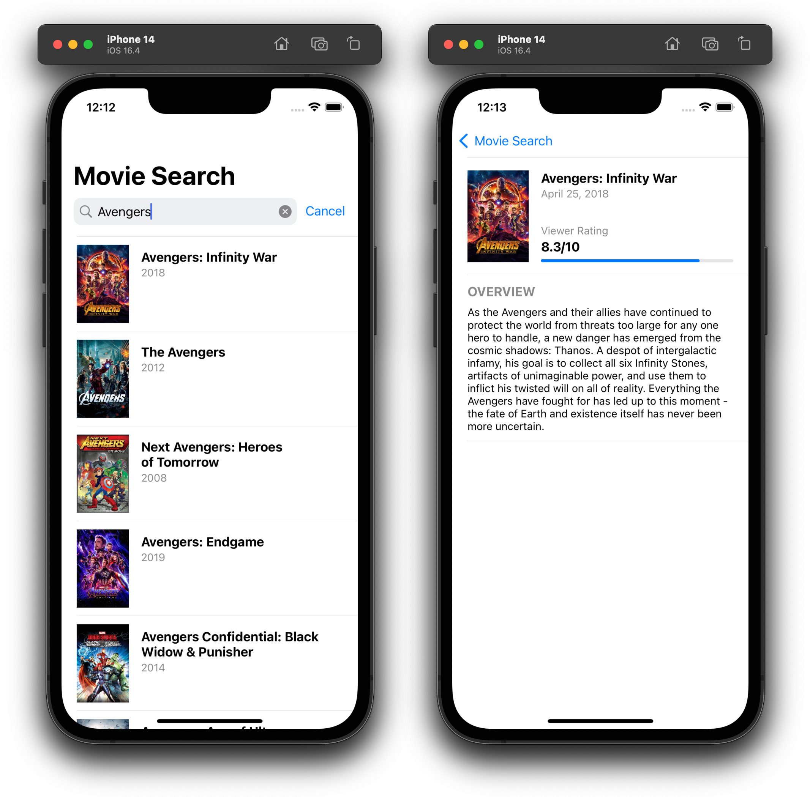

#  TheMovieDB

Sample application demonstrating a searchable movie database. Written in Swift 5 using UIKit and storyboards. Data is asynchronously fetched using async/await and decoded from JSON into Codable models before being presented to the screen. Images are cached whenever possible to avoid repetitive work. Any errors are presented to the user in the form of an alert, or logged internally (using print statements for this demo's purposes). Unit tests have been written around the fetcher calls. As a bonus, the app supports a dark appearance without any additional effort by sticking to Xcode-defined colors.

Data and images provided for free by [themoviedb.org](https://www.themoviedb.org/) for non-commercial use. API key required.
